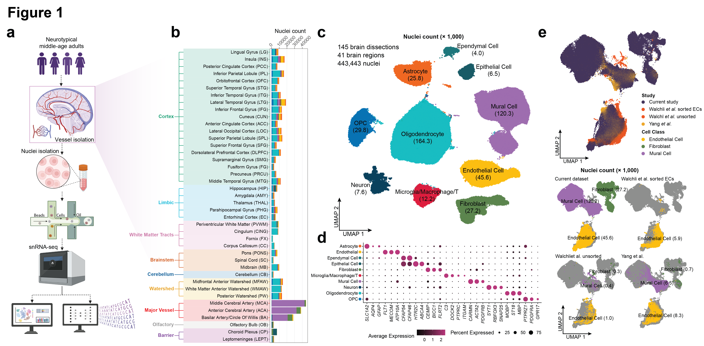

# Regional Molecular Specialization in the Human Brain Vasculature

A single-nucleus RNA-seq (snRNA-seq) atlas of vascular and vascular-adjacent cell types in the human brain.

---

<!-- FIGURE PLACEHOLDER: Replace the block below with your introductory figure -->
<p align="center">
  
  <br>
  <em>Project data overview.</em>
</p>
<!-- END FIGURE PLACEHOLDER -->

---

## Overview

### This repository accompanies the manuscript:
### Atlas of regional molecular specialization in the human brain vasculature

We present a comprehensive single-nucleus RNA sequencing (snRNA-seq) atlas of the human brain vasculature, spanning **41 anatomically defined brain regions and major cerebral vessels** from four neurotypical middle-aged adult donors. 

The dataset captures **443,443 high-quality nuclei** across all major vascular and perivascular cell types, including endothelial cells, mural cells (pericytes and smooth muscle cells), fibroblasts, astrocytes, microglia, oligodendrocytes, neurons, and OPCs.

---
## Content

```
└── Final_notebook/          # snRNA-seq QC, doublet removal, ambient RNA correction
    ├── Preprocessing
    ├── Cell class analyses
    ├── Trajectory analysis
    ├── Spatial data preprocessing & analyses
    ├── Cross-cell type analysis
    ├── Brain region visualization
    └── EWCE analysis
```

---

## Data Availability

| Resource | Link |
|---|---|
| Processed data | Available upon publication via Figshare |
| Interactive exploration | VasQ tool (see below) |

---

## VasQ

VasQ is a custom AI agent that integrates our snRNA-seq atlas with biomedical knowledge graphs (SPOKE) and web search to support CNS drug delivery hypothesis generation.

- Code and instructions: [github.com/Knight-Initiative-for-Brain-Resilience/VasQ](https://github.com/Knight-Initiative-for-Brain-Resilience/VasQ)

---

## Contact

For questions regarding the dataset or code, please contact:
- **Alina Isakova**: isakova@stanford.edu
